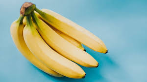

# Bananas Analysis

A regression model to predict the quality score of a banana by using the best subset of features. It discussed  about the most important statistics to consider to measure the goodness and complexity for a model.

